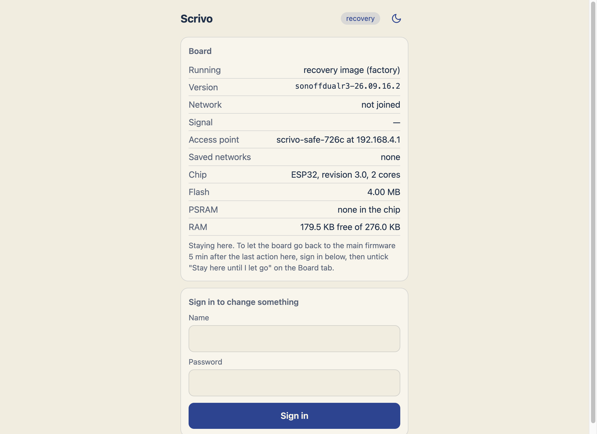
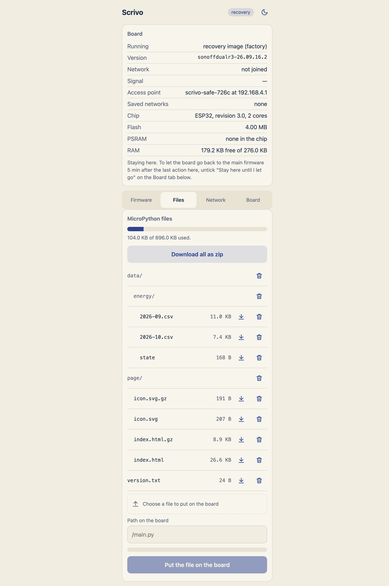
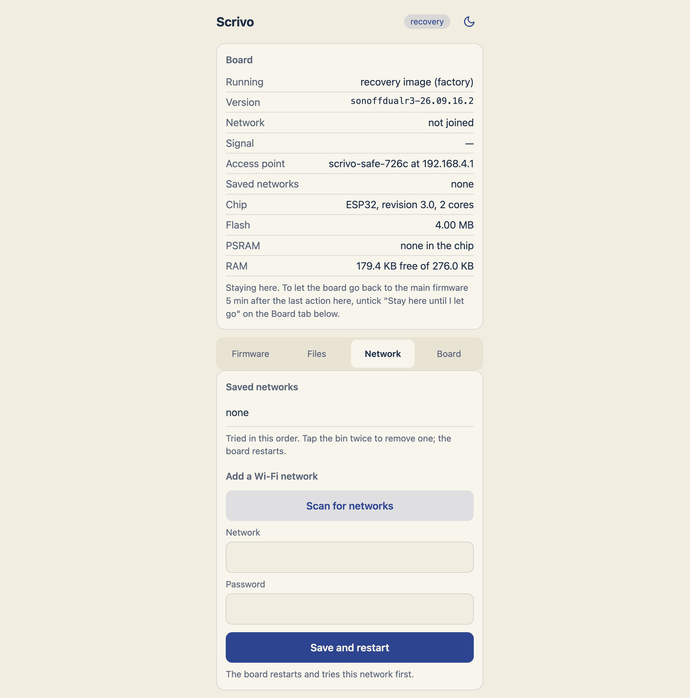
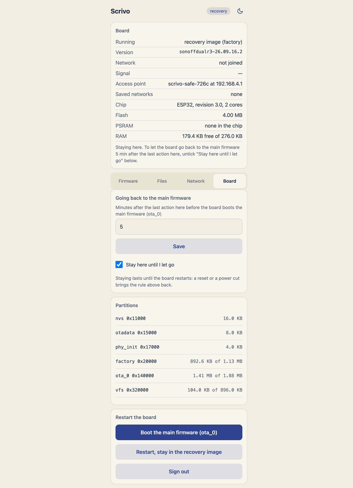
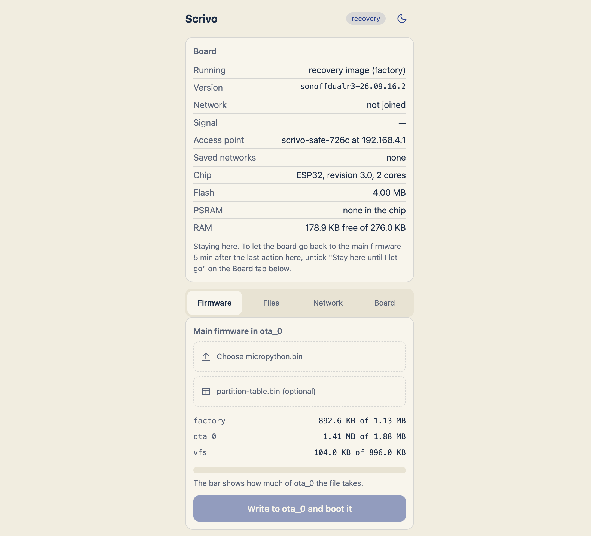
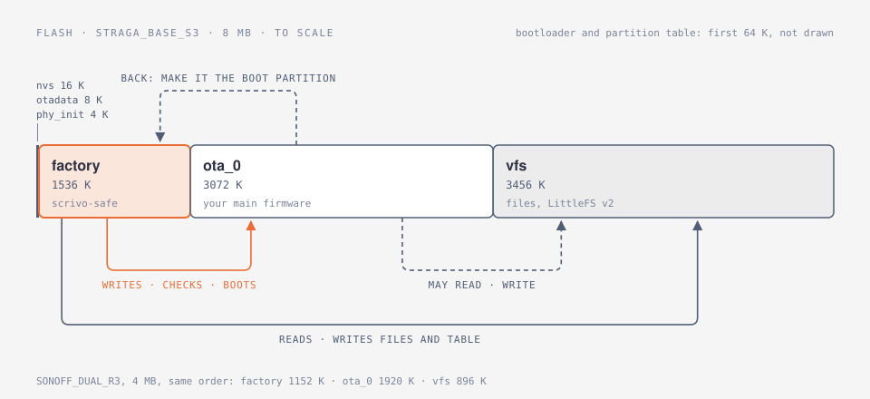

# scrivo-safe

A recovery image for ESP32 boards. It lives in its own `factory` partition, next to your main firmware in `ota_0`.
When that firmware is broken, missing, or too big for its slot, the board still comes up on Wi-Fi with a web page, and
you fix it from a browser: upload a new firmware, which the image checks before it writes a byte, or redraw the
partition table. It does this without knowing anything about the firmware it is rescuing.



## Related projects

scrivo-safe is a separate program with its own partition. It is not built with your firmware, so it does not care what
that firmware is: MicroPython, Rust, plain ESP-IDF. It recognises yours by the project name in the image header
(`esp_app_desc_t`). The name is set at build time with `SCRIVO_SAFE_MAIN_PROJECT`; the default is `micropython`.

ESPHome and Tasmota solve the same problem with a recovery that belongs to their own firmware.
[`safe_mode`](https://esphome.io/components/safe_mode/) is a mode of ESPHome: after repeated failed boots (ten by
default) it starts ESPHome with everything off except logging, the network and OTA, so you can upload a new binary.
Tasmota [Safeboot](https://tasmota.github.io/docs/Safeboot/) is a reduced Tasmota in a partition of its own, used only
for OTA updates.

## What it does

- Raises an open access point, `scrivo-safe-<xxxx>`, with a captive portal at `192.168.4.1`. It also joins the first
  saved Wi-Fi network that answers, picking the strongest access point of that network on any channel, and answers as
  `scrivo-safe-<xxxx>.local` there.
- Firmware tab: takes a firmware image, and optionally a new `partition-table.bin`, and writes it to `ota_0`. The
  header, the segment bounds and the project name are checked before anything is written. A refused image says why.
- Files tab: works on the `vfs` partition (LittleFS v2, the format MicroPython's `VfsLfs2` uses). You can list files,
  upload one, download one or everything as a zip, and put a zip back.
- Network tab: scan for networks, save them, remove them.
- Board tab: shows the partition table, sets how long the board waits for you before it boots `ota_0` on its own
  (5 minutes by default), keeps it here until you let go, or boots `ota_0` now.
- The first visit asks you to set a name and a password. Changes need a signed-in session.

| Files | Network | Board and partitions |
|---|---|---|
|  |  |  |



## Flash layout

<picture>
  <source media="(prefers-color-scheme: dark)" srcset="docs/images/flash-layout-dark.svg">
  
</picture>

Only the recovery image rewrites `ota_0`, `vfs` and the partition table. Your firmware gets back to it by making
`factory` the boot partition and restarting.

## Boards

| Board | Chip | Flash | factory / ota_0 / vfs |
|---|---|---|---|
| `STRAGA_BASE_S3` | ESP32-S3 (N8R2) | 8 MB | 1536 K / 3072 K / 3456 K |
| `SONOFF_DUAL_R3` | ESP32 | 4 MB | 1152 K / 1920 K / 896 K |

Every image on a board uses the same partition table, because the recovery image sees the whole flash and may redraw
it.

## Build

You need ESP-IDF 5.5.2, which is the version the image is tested with. [uv](https://docs.astral.sh/uv/) builds the
page when it is installed:

```sh
. $IDF_PATH/export.sh
idf.py -B build -D SCRIVO_BOARD=STRAGA_BASE_S3 build
idf.py -B build -D SCRIVO_BOARD=STRAGA_BASE_S3 -p <port> flash monitor
```

Use a separate `-B` directory for each board. The first flash writes the bootloader, the partition table and `factory`.
`ota_0` stays empty until you upload a firmware on the Firmware tab; until then the board answers on `192.168.4.1`
through its own access point.

### Which firmware it accepts

An image is accepted when the project name in its `esp_app_desc_t` equals `SCRIVO_SAFE_MAIN_PROJECT`, which you set in
`idf.py menuconfig` under `scrivo-safe`. The default is `micropython`. For your own firmware, set it to the name you
pass to `project()`.

### Add your board

Create `boards/<BOARD>/` with four files and build with `-D SCRIVO_BOARD=<BOARD>`:

- `board.yml`: what the hardware gives you: the button, the status LED (`status_led`, `neopixel` or `gpio`, and its
  pin), and the pins that are wired and must be left alone.
- `partitions.csv`: the flash layout. It must contain `nvs`, `otadata`, `phy_init`, `factory`, `ota_0` and `vfs`.
- `bootloader.sdkconfig`: chip, flash size and bootloader options.
- `version.txt`: the version the image reports, written as `<board>-<yy.mm.dd>.<n>`.

## Tests

```sh
uv run --no-project --with zopfli python -m unittest tests/host/test_status_parts.py tests/host/test_files_zip.py \
    tests/host/test_board_led.py tools/test_build_web.py tools/test_bootloader_match.py
```

The host tests build the zip and filesystem code with the host C compiler, with the address and undefined-behaviour
sanitizers on, and run it over real LittleFS images.

## License

MIT, see [LICENSE](LICENSE). Bundled third-party code keeps its own terms: `third_party/littlefs` is BSD-3-Clause, and
`tests/host/vendor/miniz` is the Unlicense, a public-domain dedication; only the host tests use it. Each has its own
LICENSE file. The image links ESP-IDF, which is Apache-2.0.

## Credits

Built by **straga** together with AI coding agents: **Claude Code** (Anthropic), **Codex** (OpenAI), **GLM** (Z.ai)
and a local **Qwen** model. The agents wrote much of the code, tests and this README; every change was reviewed and
tested on real boards before it went in.
